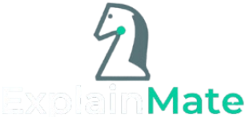

<div align="center">



<br/>

**An Explainable AI chess engine built with a hybrid CNN + classical ML pipeline,
trained on Stockfish evaluations and deployed as an interactive web application.**

<br/>

[](https://python.org)
[](https://tensorflow.org)
[](https://flask.palletsprojects.com)
[](https://scikit-learn.org)
[](LICENSE)

<br/>

[**▶ Play Live**](https://github.com/gautham-balaji/chess-bot/issues) · [Report a Bug](https://github.com/gautham-balaji/chess-bot/issues) · [View Notebook](chess_model_FINAL.ipynb)

</div>

---

## Table of Contents

- [Overview](#overview)
- [Features](#features)
- [How It Works](#how-it-works)
  - [Board Representation](#1-board-representation)
  - [CNN Position Evaluator](#2-cnn-position-evaluator)
  - [Classical ML Models](#3-classical-ml-models)
  - [Ridge Weight Model](#4-ridge-weight-model)
  - [Hybrid Scoring Function](#5-hybrid-scoring-function)
  - [Move Reranker](#6-move-reranker)
  - [Explainability Layer](#7-explainability-layer)
  - [Integrated Gradients Saliency](#8-integrated-gradients-saliency-post-game)
- [Architecture Diagram](#architecture-diagram)
- [XAI: What Makes This Explainable](#xai-what-makes-this-explainable)
- [Project Structure](#project-structure)
- [Installation & Local Setup](#installation--local-setup)
- [API Reference](#api-reference)
- [Model Performance](#model-performance)
- [Dataset](#dataset)
- [Academic Context](#academic-context)

---

## Overview

This project is a fully playable chess engine with a focus on **Explainable AI (XAI)** — the engine doesn't just pick moves, it tells you *why*.

The engine combines a **Convolutional Neural Network** (trained on Stockfish centipawn evaluations) with **classical ML heuristics** — material balance, space control, center control, and mobility — fused together by a **Ridge regression weight model** that was itself fitted against Stockfish targets. The result is a lightweight but principled evaluator that can justify every decision it makes in plain English.

The web interface (Flask + vanilla JS) lets you play against the engine with full drag-and-drop piece movement, a live analysis panel showing the top 3 recommended moves, per-move explanations, a position evaluation bar, and a post-game stats screen with an Integrated Gradients saliency heatmap of the final board position.

---

## Features

| Feature | Description |
|---|---|
| 🎮 **Interactive Board** | Click-to-move or drag-and-drop, with legal move highlighting and promotion picker |
| 🧠 **Hybrid Engine** | CNN eval + hand-crafted heuristics, fused by a learned Ridge weight model |
| 💬 **Move Explanations** | Every candidate move is annotated with human-readable reasons |
| 📊 **Live Metrics** | Material balance, space control, center control, mobility — updated every half-move |
| 🔍 **Analyse Mode** | Request engine recommendations for the current position without making a move |
| ⚙️ **Top 3 Moves Panel** | The engine's top 3 choices ranked by composite score, each with a ▶ Play button |
| 🏳️ **Resign** | Player can forfeit at any time, triggering the post-game stats screen |
| 🗺️ **Saliency Map** | Integrated Gradients heatmap over the board, showing which squares the CNN focused on |
| 📈 **Game Stats** | End-of-game summary: move counts, captured pieces, average positional metrics |
| ♟️ **Pawn Promotion** | Full promotion picker (Queen, Rook, Bishop, Knight) |
| 📱 **Touch Support** | Touch drag-and-drop for mobile and tablet browsers |

---

## How It Works

The engine is built in layers. Each layer adds explanatory signal on top of the previous one.

### 1. Board Representation

Every chess position is converted into an **8×8×12 tensor** — one binary plane per piece type per color (6 piece types × 2 colors). A `1` in a cell means that piece occupies that square; `0` means it doesn't. This is the standard multi-plane representation used by neural chess engines.

```
Channels 0–5  →  White: Pawn, Knight, Bishop, Rook, Queen, King
Channels 6–11 →  Black: Pawn, Knight, Bishop, Rook, Queen, King
```

```python
def board_to_planes(board):
    planes = np.zeros((8, 8, 12), dtype=np.float32)
    for square, piece in board.piece_map().items():
        row = 7 - (square // 8)
        col = square % 8
        offset = 0 if piece.color == chess.WHITE else 6
        planes[row, col, piece_to_index[piece.symbol().upper()] + offset] = 1
    return planes
```

---

### 2. CNN Position Evaluator

A **Convolutional Neural Network** is trained to predict Stockfish centipawn evaluations directly from the board tensor. Stockfish (depth 8) was used to label **10,000 positions** sampled from real games in the dataset.

> **Training distribution matters here.** Every training position was taken at **exactly ply 20** (after 10 full moves), so the model saw no endgames and no late middlegames. Labels were clipped to ±1500 cp. Source: `chess_model_FINAL.ipynb` cell 14 (`df.sample(10000, random_state=42)`, retained output `Collected: 10000 valid positions`).

**Architecture:**

```
Input: (8, 8, 12)
→ Conv2D(64,  3×3, ReLU, same) + BatchNorm
→ Conv2D(128, 3×3, ReLU, same) + BatchNorm
→ Conv2D(128, 3×3, ReLU, same) + BatchNorm
→ Flatten
→ Dense(256, ReLU) + Dropout(0.3)
→ Dense(1)   ← centipawn output (regression)
```

The CNN learns spatial patterns across the board — which piece configurations tend to be good or bad — without any hand-crafted rules. It outputs a raw centipawn score for any position.

**How well does the CNN fit its training target?**
- Pearson correlation **0.708** between CNN output and Stockfish depth-8 centipawn labels, on the held-out 20% split (**~2,000 positions**). Source: `chess_model_FINAL.ipynb` cell 16, retained output.

This measures how closely the CNN reproduces its *training labels* on positions drawn from the same ply-20 distribution. **It is not a measure of playing strength**, and it does not generalise to endgames, which the model never saw.

For how the full engine compares to Stockfish on move selection, see [Measured Performance](#measured-performance) below.

---

### 3. Classical ML Models

Two additional sklearn models were trained on game-level features extracted from the dataset:

**Random Forest Regressor** — predicts *future space control* (space advantage at move 20) from features available at move 10:

| Feature | Importance |
|---|---|
| `mat20` (material at move 20) | 59.2% |
| `space10_diff` (space at move 10) | 11.9% |
| `white_rating` | 4.5% |
| `elo_diff` | 4.3% |
| `black_rating` | 4.3% |
| others | ~16% |

The dominance of `mat20` confirms that material advantage is the strongest predictor of spatial control — a finding consistent with classical chess theory.

**MLP Classifier** (256 → 128 → 64 hidden layers) — predicts *game outcome* (White win / Black win / Draw) from the same feature set. Trained with `StandardScaler` normalization. Used during the XAI analysis phase of the project to understand which position features correlate most with winning.

---

### 4. Ridge Weight Model

The CNN score alone isn't enough — it needs to be combined with interpretable heuristics in a principled way. A **Ridge regression model** was fitted to learn the optimal linear weights for combining five signals against Stockfish centipawn targets:

```
Learned weights:
  CNN (normalised):   330.9
  Material balance:    32.4
  Space control:        0.79
  Center control:       5.17
  Mobility:             0.019
```

This means the CNN contributes the dominant signal, with material balance as a strong secondary factor — exactly what you'd expect. The weights give the hybrid score a grounding in real Stockfish evaluations rather than arbitrary hand-tuning.

---

### 5. Hybrid Scoring Function

For any board position, the composite score is:

```
score = w[0] * tanh(cnn_cp / 200)
      + w[1] * material_balance
      + w[2] * space_control
      + w[3] * center_control
      + w[4] * mobility
```

Where `w` is the Ridge weight vector above. The `tanh` normalisation on the CNN output prevents extreme centipawn values from dominating.

On top of this base score, four **heuristic bonuses** are added per-move (not per-position):

| Bonus / Penalty | Value | Trigger |
|---|---|---|
| Opening center bonus | +0.30 | e4, d4, or c4 in the opening |
| Development bonus | +0.20 | Moving a Knight or Bishop |
| Tactical bonus | +0.10 to +0.50 | Captures (scaled by piece value), checks (+0.20), promotions (+0.40) |
| Pawn push penalty | −0.20 | Early pawn push from rank 2 |

---

### 6. Move Reranker

Rather than evaluating one position at a time, the engine uses **batched inference** across all legal moves in a single CNN call — significantly faster than per-move evaluation.

**Algorithm:**

1. For every legal move, push it on the board and collect the resulting tensor.
2. Run all tensors through the CNN in a single `model.predict(batch)` call.
3. Compute the hybrid score for each resulting position.
4. Apply heuristic bonuses.
5. **1-ply look-ahead:** for each candidate move, batch-predict the opponent's best response and subtract a penalty (`0.5 × tanh(best_opp_score / 200)`). This gives the engine a basic sense of not walking into immediate refutations.
6. Sort by score (descending for White, ascending for Black) and return the ranked list.

---

### 7. Explainability Layer

After ranking, `explain_move()` annotates the best move with a list of human-readable reasons. Each reason corresponds to a concrete, checkable condition:

| Reason | Condition |
|---|---|
| *"strengthens control of the center"* | Destination square is d4, e4, d5, or e5 |
| *"develops a minor piece"* | Moving a Knight or Bishop |
| *"expands space with a pawn advance"* | Pawn moves to rank 3 or higher |
| *"captures an opponent piece"* | `board.is_capture(move)` |
| *"delivers a check to the opponent king"* | `board.is_check()` after pushing the move |
| *"promotes a pawn"* | `move.promotion` is set |
| *"neural evaluation indicates a positional improvement"* | `cnn_cp > 100` |
| *"increases board control by +N squares"* | Space control delta is positive |

This is the core XAI contribution: every engine decision can be traced back to both a quantitative score and a symbolic, human-interpretable justification.

---

### 8. Integrated Gradients Saliency (Post-Game)

After the game ends, the app computes an **Integrated Gradients** saliency map over the final board position. This is a standard XAI attribution technique that answers: *"which input features (squares) most influenced the CNN's output?"*

**Method:**
1. Define a baseline (all-zeros tensor — empty board).
2. Interpolate 50 steps between the baseline and the actual board tensor.
3. Run the CNN on all 51 interpolated inputs simultaneously.
4. Compute gradients of the output with respect to the interpolated inputs via `tf.GradientTape`.
5. Average the gradients and multiply by `(input − baseline)`.
6. Sum absolute attributions across all 12 channels per square to get an 8×8 importance map.
7. Normalise to [0, 1] and render as an overlay on the board.

Squares with high saliency are the ones the CNN was "looking at" most when evaluating the final position. This gives you a window into the neural network's spatial reasoning.

---

## Architecture Diagram

```
┌──────────────────────────────────────────────────────────────────┐
│                        Chess Position                            │
└────────────────────────────┬─────────────────────────────────────┘
                             │
                    board_to_planes()
                    (8 × 8 × 12 tensor)
                             │
              ┌──────────────┴──────────────┐
              │                             │
         CNN Model                   Heuristic Functions
    (3× Conv2D + Dense)           ┌─────────────────────┐
              │                   │  material_balance()  │
         cnn_cp (float)           │  space_control()     │
              │                   │  center_control()    │
       tanh(cnn_cp/200)           │  mobility_score()    │
              │                   └─────────────────────┘
              └──────────────┬──────────────┘
                             │
                    Ridge Weight Model
               w[0]·CNN + w[1]·mat + w[2]·space
                   + w[3]·center + w[4]·mob
                             │
                      base_score (float)
                             │
               + Heuristic Move Bonuses
          (center bonus, development, tactical, penalty)
                             │
                    1-ply Opponent Look-ahead
                  (batch CNN on opp responses)
                             │
                    ┌────────┴────────┐
                    │  Ranked Moves   │
                    │  (best → worst) │
                    └────────┬────────┘
                             │
                    explain_move()
               (symbolic reasons list)
                             │
                    ┌────────┴────────┐
                    │  Response JSON  │
                    │  · best move    │
                    │  · top 3 moves  │
                    │  · reasons[]    │
                    │  · metrics{}    │
                    └─────────────────┘
```

---

## XAI: What Makes This Explainable

Most chess engines (including Stockfish) are strong but opaque — they give you a number, not a reason. This engine is designed around the principle that every recommendation should be traceable.

There are three levels of explanation built into the system:

**1. Local move explanation** — for every move the engine considers, `explain_move()` generates a plain-English list of reasons grounded in chess concepts (development, center control, captures, checks). You don't need to know what a centipawn is to understand *"develops a minor piece and increases board control by +3 squares."*

**2. Quantitative metrics panel** — the live sidebar shows material balance, space control, center control, and mobility updated after every half-move. You can watch these metrics change as the game progresses and connect them to the engine's recommendations.

**3. Post-game saliency heatmap** — Integrated Gradients attribution shows which squares the CNN was attending to in the final position. This is a global explanation of the neural component: rather than trusting the CNN as a black box, you can inspect its spatial reasoning.

The Ridge weight model also contributes to interpretability: its learned coefficients tell you, quantitatively, how much the engine cares about material vs. space vs. neural intuition. These weights were fitted against real Stockfish evaluations, so they reflect principled chess knowledge rather than arbitrary design choices.

---

## Project Structure

```
chess-bot/
├── app.py                      # Flask server — routes, game state, saliency
├── engine.py                   # ML pipeline — evaluation, reranking, explanations
├── config.py                   # Repo-relative paths + Stockfish resolution
├── chess_model_FINAL.ipynb     # Training notebook — full pipeline with outputs
├── requirements.txt            # Runtime dependencies (pinned)
├── requirements-notebook.txt   # Extra deps for re-running the notebook
├── .env.example                # Template for machine-specific config
│
├── models/
│   ├── cnn_model.keras          # CNN evaluator            (loaded at runtime)
│   ├── weight_model.pkl         # Ridge fusion weights     (loaded at runtime)
│   ├── rf_model.pkl             # training artifact — not loaded at runtime
│   ├── mlp_model.pkl            # training artifact — not loaded at runtime
│   └── scaler.pkl               # training artifact — not loaded at runtime
│
├── templates/index.html        # Single-page frontend (vanilla JS, no framework)
├── static/                     # logo.png, titlelogo.png
│
├── docs/
│   ├── REPRODUCIBILITY.md       # Setup, environment, known limitations
│   └── PHASE_1_REPORT.md        # What the integrity pass changed
│
├── baseline/                   # Measured "before" reference (BASELINE.md + JSON)
├── verification/               # Behaviour-preservation checks
└── archive/                    # Preserved invalid benchmark artifacts + why
```

> `games.csv` is gitignored and not distributed. `venv/` is gitignored.


## Installation & Local Setup

> Full setup, environment variables and known limitations: **[`docs/REPRODUCIBILITY.md`](docs/REPRODUCIBILITY.md)**.

### Prerequisites

- **Python 3.12** (verified on 3.12.10). The dependency set is pinned to this version; older pins in earlier revisions of this file were incorrect
- `pip`
- Stockfish binary — **optional**. Gameplay never calls Stockfish; it is used only by `/benchmark` and to re-run training

### Steps

**1. Clone the repository**

```bash
git clone https://github.com/gautham-balaji/chess-bot.git
cd chess-bot
```

**2. Create and activate a virtual environment**

```bash
python -m venv venv

# macOS / Linux
source venv/bin/activate

# Windows
venv\Scripts\activate
```

**3. Install dependencies**

```bash
pip install -r requirements.txt
```

**4. Model files**

The models are committed to this repository under `models/`. Only **two** are needed at
runtime:

```
models/cnn_model.keras     # CNN position evaluator          (required)
models/weight_model.pkl    # Ridge fusion weights            (required)

models/rf_model.pkl        # training artifact - NOT loaded at runtime
models/mlp_model.pkl       # training artifact - NOT loaded at runtime
models/scaler.pkl          # training artifact - NOT loaded at runtime
```

Model paths resolve relative to the repository, not to your shell's working directory,
so the app can be started from anywhere.

**5. (Optional) Configure Stockfish**

Only needed for `/benchmark`.

```bash
cp .env.example .env
# then set STOCKFISH_PATH in .env
```

If unset, the app looks for `stockfish` on `PATH`, then common install locations. When it
cannot be found, `/benchmark` returns `{"stockfish": {"available": false, ...}}` and
everything else works normally.

**6. Run the server**

```bash
python app.py
```

**7. Open in browser**

```
http://127.0.0.1:5000
```

> ⚠️ Do **not** open `index.html` directly or use VS Code Live Server. The page must be served by Flask so that the `/state`, `/move`, and `/engine_move` API routes are available on the same port.

---

## API Reference

All endpoints are served by Flask on port 5000.

| Method | Route | Description |
|---|---|---|
| `GET` | `/` | Serves the frontend (`index.html`) |
| `GET` | `/state` | Returns full board state as JSON |
| `POST` | `/move` | Apply a player move (UCI string in body) |
| `POST` | `/engine_move` | Compute and apply the engine's response |
| `POST` | `/analyse` | Get top 3 moves + metrics without making a move |
| `POST` | `/forfeit` | Player resigns |
| `POST` | `/game_stats` | Returns post-game stats + saliency map |
| `POST` | `/reset` | Reset board to starting position |
| `POST` | `/benchmark` | Compare engine vs Stockfish on the current position (requires Stockfish; degrades gracefully) |
| `GET` | `/model_info` | Live CNN architecture, layer shapes and parameter counts |

> **State model:** the server keeps a **single game in module-level globals**, so all
> clients share one board and requests are order-dependent. This is a known limitation,
> not a design feature.

> **Known API quirk:** a `POST /move` with a non-JSON body returns **415 with an HTML
> body**, unlike every other error path which returns `{"error": ...}` as JSON. Confirmed
> in [`baseline/api_results.json`](baseline/api_results.json); not yet fixed.

**Example — make a move:**

```bash
curl -X POST http://127.0.0.1:5000/move \
  -H "Content-Type: application/json" \
  -d '{"uci": "e2e4"}'
```

**Example response from `/engine_move`:**

```json
{
  "engine": {
    "uci": "e7e5",
    "san": "e5",
    "from": "e7",
    "to": "e5",
    "explanation": [
      "strengthens control of the center",
      "expands space with a pawn advance",
      "increases board control by +4 squares"
    ],
    "top_moves": [...]
  },
  "pieces": { "e4": "wP", "e5": "bP", ... },
  "metrics": {
    "material": 0,
    "space": -1,
    "center": 0,
    "mobility": 2,
    "cnn_eval": 18.4
  },
  ...
}
```

---

## Measured Performance

All figures below come from a reproducible measurement run. Method, raw data and
caveats: [`baseline/BASELINE.md`](baseline/BASELINE.md).

**Reference:** Stockfish 17.1 at depth 8 (Threads=1, Hash=16).
**Suite:** 52 fixed FEN positions ([`baseline/fens.json`](baseline/fens.json)) spanning
opening / middlegame / endgame / tactical / defensive, 30 White to move and 22 Black to move.

### Engine vs Stockfish — move selection

| Metric | Value | Random-move baseline |
|---|---:|---:|
| Legal move returned | **52 / 52 (100%)** | — |
| Top-1 move agreement | **19.2%** (10/52) | 5.9% |
| Engine move in Stockfish's top 3 | **36.5%** (19/52) | 17.7% |
| Determinism (2 passes, same process) | **52 / 52 identical** | — |

Top-1 agreement is roughly **3.3× better than picking a legal move at random**, so the
engine is clearly doing something. It is *not* an accuracy score: chess positions often
have several near-equal good moves, and disagreeing with Stockfish is not automatically
an error. These rates describe **this 52-position suite** — it is a fixed comparison set,
not a statistically representative sample, and no confidence intervals are implied.

### Speed

| | Mean | Median | p95 |
|---|---:|---:|---:|
| This engine | 617 ms | 638 ms | 1,005 ms |
| Stockfish (depth 8) | 5.1 ms | 3.4 ms | 15.4 ms |

**This engine is roughly 121× slower than Stockfish at depth 8** on identical positions
and hardware. Earlier versions of this README and its charts claimed the opposite; that
claim was never measured and has been removed. The engine runs ~400 CNN forward passes
per move in Python (batched candidate evaluation plus a 1-ply reply scan), against
optimised C++ with alpha-beta pruning.

### Component models

| Model | Task | What is actually known |
|---|---|---|
| CNN | Centipawn evaluation | Pearson **r = 0.708** vs depth-8 labels on a ~2,000-position holdout (notebook cell 16). Label fit, not playing strength |
| Ridge | Fuses CNN + 4 heuristics | 5-feature linear model fitted on Stockfish CP targets. Learned weights `[330.9, 32.4, 0.79, 5.17, 0.019]` |
| Random Forest | Space-control prediction at move 20 | R² **0.5146**, RMSE **5.03** (notebook cell 6). **Not used by the engine at runtime** |
| MLP | Game-outcome classification | Accuracy **0.7228** (notebook cell 8); never predicts the draw class (f1 = 0.00). **Not used by the engine at runtime** |

> **What is not yet measured.** There is no move-quality (centipawn-loss) metric, no MAE,
> no Elo estimate, and no playing-strength result. Building a proper evaluation harness is
> planned work. Until it exists, this README does not report those numbers.

### A note on the Ridge weights

The learned coefficient on the CNN term is **330.9**, while a full pawn of material is
worth **32.4**. The hand-crafted move bonuses elsewhere in the engine are worth 0.2–0.5,
against observed score ranges of roughly 55–240. In other words the Ridge layer learned
that **the CNN dominates**, and the hand-written heuristics contribute well under 1% of
the final score. The explanations the UI shows are therefore best understood as
*post-hoc rationalisation of a neural decision*, not a description of the scoring
function.

---

## Dataset

**Source:** [Lichess open database](https://database.lichess.org/) (`games.csv`)

The dataset contains real online chess games with player ratings, move sequences in SAN notation, and game outcomes. Features were extracted at move 10, 15, and 20 for each game to study how early positional factors predict late-game outcomes.

Stockfish (depth 8) was used to generate centipawn labels for **10,000** board positions sampled from this dataset for CNN training, each taken at ply 20.

> `games.csv` is **not distributed with this repository** (it is gitignored). The training notebook therefore cannot be re-run from a clean clone without obtaining the dataset separately. See [`docs/REPRODUCIBILITY.md`](docs/REPRODUCIBILITY.md).

---

<div align="center">

Gautham Balaji · Naren Kumar  
<span style="font-size:0.75em; color:gray;">2026</span>

</div>
